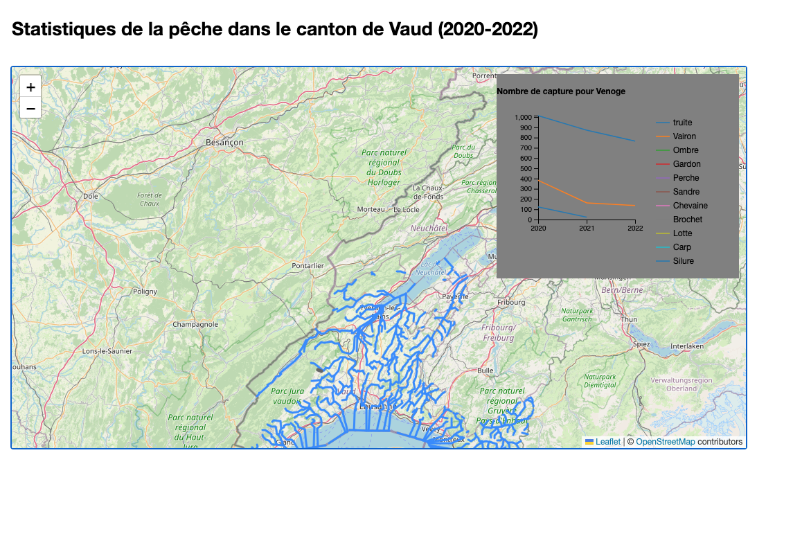

# Visualisation des donnees-carte interactive de la peche dans le canton de Vaud pour les années de 2020 à 2022

Cette carte représente les statistiques de pêche (nombre de capture par type de poisson et par rivière) dans le canton de Vaud pour les années 2020, 2021 et 2022 de manière interactive. 

## Base de données
### Données géographique
Les données géographique proviennent de [leaflet](https://leafletjs.com/) qui est un contributeur  d'[OSM](https://www.openstreetmap.org/). Leaflet est une bibliothèque javaScript qui permet de créer des cartes interactives et est en open source.

Pour la couche des rivières, elle provient également d'OSM et a été exporté grâce à [overpass_turbo](https://overpass-turbo.eu/).
### Données statistiques
Les données statistiques concernant les captures de pêche sont disponibles sur [le site du canton de vaud](https://www.vd.ch/environnement/biodiversite-et-paysage/peche-1#c2028692). Pour rendre ces données utilisables, il a fallu les transformer de PDF à excel et ensuite les joindre pour avoir les statistiques par années et par rivière. En effet, les données venait sous le format d'PDF par année. Une fois cela fait il a fallu changer les noms des rivières dans le tableau excel pour qu'ils correspondent aux noms des rivières dans la couche Shapefile qui a été transformé par la suite en Geojson.

## Description des fonctionnalités du projet

Voici la liste des fonctionnalités de la carte :
- En arrivant sur la carte les rivière s'affichent ainsi qu'un rectangle gris ou se trouvera le graphique en l'abscence de rivière selectionné, on trouve "Statistique" et "selectionner une rivière" dans le rectangle gris.
- Il est possible de selectionner une rivière en passant avec la souris sur une rivière. si c'est le cas alors le graphique s'affiche dans le carré gris.
- il est aussi possible se selectionner une rivière en appuyant avec la souris dessus cela va zommer sur la rivière selectionné en plus d'afficher la graphique correspondant.

## Outils

d3 a permis la visulation du graphique de type "linechart" ainsi que la couche des rivières et [leaflet](https://leafletjs.com/) la visualisation du fond de carte.

## Données

Pour les données géogrpahique, chaque entrée correspond à une rivière et contient les propriétées suivantes :
- OBJEKTID
- OBJORIG
- NAMN

Pour les données statistiques, chaque entrée correspond également à une rivière et contient les propriétées suivantes :
- Nom de la rivière
- Type de poisson
- Nombre de capture
- Année de capture

Les champs ont pu être regrouper grâce au nom des rivirères.

## Interface

l'interface est composé d'un fond de carte, auquel vient s'ajouter une couche de rivière ainsi qu'un rectangle gris qui servira au graphique des captures par poisson et par année. D'un graphique qui permet

## Utilisation

Ce projet n'est pas sur un serveur, il faut donc l'afficher localement. Il existe de multiples méthodes pour faire cela. Toutefois, nous vous proposons une explication étape par étape ci-dessous pour afficher localement notre projet en utilisant python3.
1. Télécharger le zip du projet, le décompresser
2. Ouvrir un Terminal et changer le chemin pour aller au dossier décompressé précédemment
ex : cd /Users/username/Desktop/Visualisation_des_donnees
3. Lancer un serveur local en lançant la commande suivante dans le terminal : `python3 -m http.server`
4. Le terminal devrait afficher la phrase suivante : `Serving HTTP on :: port 8000`
5. Ouvrir un navigateur (Firefox, Chrome) et entrer l'adresse suivante : `localhost:8000`

## Auteur

Ce projet a été réalisé par Paul Bühlmann pour le cours "Visualisation des données" donné par Isaac Pante à l'UNIL en 2024.

## Remerciments

Mike Bostock pour D3, et tout les exemples.
Isaac Pante pour les cours et conseils.
Max Henking pour son aide précieuse et ces conseils.
