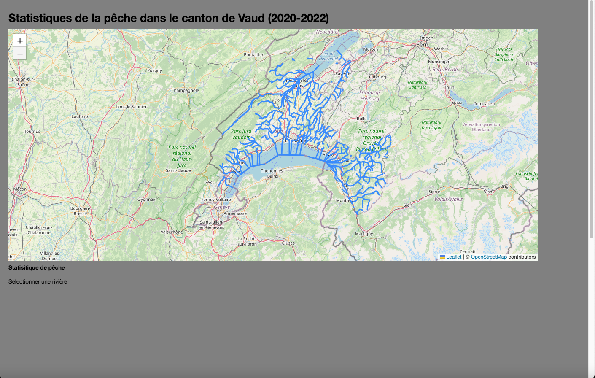

# Visualisation des donnees-carte interactive de la peche dans le canton de Vaud pour les années de 2020 à 2022

Cette carte représente les statistiques de pêche (nombre de capture par type de poisson et par rivière) dans le canton de Vaud pour les années 2020, 2021 et 2022 de manière interactive. 

## Base de données
### Données géographique
Les données géographiques proviennent de [leaflet](https://leafletjs.com/) qui est un contributeur d'[OSM](https://www.openstreetmap.org/). Pour la couche des rivières, elle provient également d'OSM et a été exportée grâce à [overpass_turbo](https://overpass-turbo.eu/).
### Données statistiques
Les données statistiques concernant les captures de pêche sont disponibles sûr [le site du canton de vaud](https://www.vd.ch/environnement/biodiversite-et-paysage/peche-1#c2028692). Pour rendre ces données utilisables, il a fallu les transformer de PDF à Excel et ensuite les joindre pour avoir les statistiques par années et par rivière. En effet, les données venaient sous le format d'un PDF par année. Une fois cela fait, il a fallu changer les noms des rivières dans le tableau excel pour qu'ils correspondent aux noms des rivières dans la couche Shapefile qui a été transformée par la suite en Geojson.

## Description des fonctionnalités du projet

Voici la liste des fonctionnalités de la carte :
- En arrivant sur la carte, les rivières s'affichent. En l'absence de rivière sélectionné, on trouve "Statistique" et "sélectionner une rivière" sur le fond gris en dessous de la carte.

- Il est possible de sélectionner une rivière en passant avec la souris sur une rivière. Si c'est le cas alors le graphique s'affiche dans le carré gris.
- il est aussi possible se sélectionner une rivière en appuyant avec la souris dessus cela va zoomer sur la rivière sélectionnée en plus d'afficher la graphique correspondant.

## Outils

d3 a permis la visualisation du graphique de type "linechart" ainsi que la couche des rivières.

Leaflet est une bibliothèque javaScript en open source qui permet de créer des cartes interactives. On y trouve un certain nombre de commande et de tutoriel pour faciliter l'utilisation. Leaflet a permis la visualisation du fond de carte.

## Données

Pour les données géogrpahiques, chaque entrée correspond à une rivière et contient les propriétés suivantes :
- OBJEKTID
- OBJORIG
- NAMN

Pour les données statistiques, chaque entrée correspond également à une rivière et contient les propriétés suivantes :
- Nom de la rivière
- Type de poisson
- Nombre de capture
- Année de capture

Les champs ont pu être regroupés grâce au nom des rivières.

## Interface

L'interface est composée : 
- D'un fond de carte
- Une couche de rivière du canton de Vaud
- D'un rectangle gris qui servira à l'affichage du graphique des captures par poisson et par année.
- D'un graphique de type "linechart" qui permet de visualiser le nombre de capture par type de poisson et par année. L'échelle du nombre de capture se met à jour automatiquement pour améliorer la visibilité du graphe. 

## Utilisation

Ce projet n'est pas sur un serveur, il faut donc l'afficher localement. Il existe de multiples méthodes pour faire cela. Toutefois, nous vous proposons une explication étape par étape ci-dessous pour afficher localement notre projet en utilisant python3.
1. Télécharger le zip du projet, le décompresser
2. Ouvrir un Terminal et changer le chemin pour aller au dossier décompressé précédemment
ex : cd /Users/username/Desktop/nom_du_fichier
3. Lancer un serveur local en lançant la commande suivante dans le terminal : `python3 -m http.server`
4. Le terminal devrait afficher la phrase suivante : `Serving HTTP on :: port 8000`
5. Ouvrir un navigateur (Firefox, Chrome) et entrer l'adresse suivante : `localhost:8000`

Une autre manière de faire est de télécharger un éditeur de code comme [Visual studio code](https://code.visualstudio.com/) et de suivre les étapes suivantes :
1. Télécharger le zip du projet, le décompresser
2. Ouvrir le dossier dans [Visual studio code](https://code.visualstudio.com/)
3. Sélectionner le fichier ".html"
4. Appuyer sur "Go Live" en bas à droite de la fenêtre
5. Le navigateur s'ouvre avec le projet 
   

## Auteur

Ce projet a été réalisé par Paul Bühlmann pour le cours "Visualisation des données" donné par Isaac Pante à l'UNIL en 2024.

## Remerciments

Mike Bostock pour D3, et tous les exemples.
Isaac Pante pour les cours et conseils.
Max Henking pour son aide précieuse et ces conseils.
